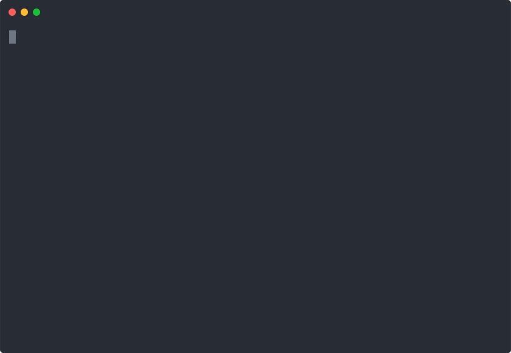
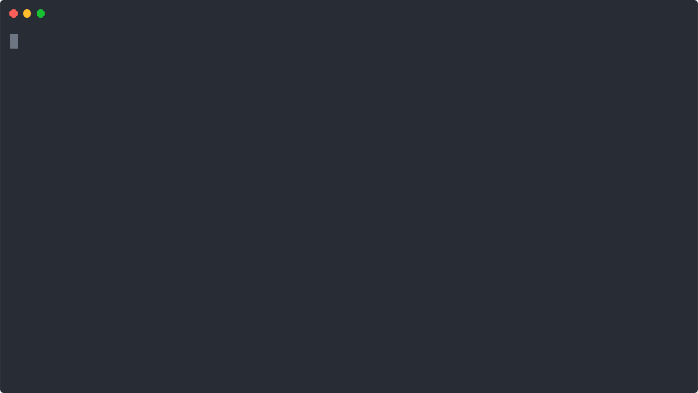

# fish-yvm (Yarn Version Manager written in Fish :fish:)

> Version manager for yarn written in & for Fish

- Uses Fish's awesome <kbd>tab</kbd>-completion
- Minimal, no setup, no dependencies
- Works even with extremely old versions
- Extremely simple: it just adds the path to the installed yarn version to `$fish_user_paths` and doesn't mess with anything else.
- Heavily inspired by the super awesome [fish node version manager](https://github.com/jorgebucaran/fish-nvm)



## Quickstart

```shell
fisher add cideM/fish-yvm
yvm use latest
```

## Installation

### Fisher

Install with [Fisher](https://github.com/jorgebucaran/fisher) (recommended):

```shell
fisher add cideM/fish-yvm
```

### Manual

This assumes that you're fish config folder is located under `~/.config/fish`

```fish
for i in functions completions
  curl https://raw.githubusercontent.com/cideM/fish-yvm/master/$i/yvm.fish --create-dirs -sLo $XDG_CONFIG_HOME/fish/$i/yvm.fish
end
```

## Usage

### `use <version>`

Installs and activates given version of `yarn`. Version needs to exactly match one of the versions returned from `yvm ls`, which will be suggested through tab completion. The only exception to this rule is that `latest` will always install the most recent `yarn` version. Takes an optional `-f` or `--force-fetch` flag, which forces fetching the list of available resources from remote. If not the list is only updated if it's older than 120s.

List of releases is stored under `$XDG_CONFIG_HOME/yvm-fish/yarn_releases` (for most people this will be `~/.config/yvm-fish/yarn_releases`.

The currently active version is stored under `$XDG_CONFIG_HOME/yvm-fish/version`.

Example:

```fish
yvm use 1.19.0
```

### `ls`/`list`

Lists all available `yarn` releases. Takes the same `-f` flag as `use`, with the same caching behavior. If you want to only see the installed versions, just pipe the output into something like `grep`.

Examples:

```shell
yvm ls | grep installed
yvm ls | grep active
```

```fish
$ yvm ls | head -n 5
1.19.1   installed       active
1.19.0   installed
1.18.0
1.17.3
1.17.2
```

### `rm <version>`

Removes specified version from file system and PATH. Same version matching rules as for `use` apply, including `latest`.

Example:

```fish
yvm rm 1.19.0
```

### `help`

Prints the help, just like `yvm -h` and `yvm --help`

## How To

### Show Installed Versions

```fish
yvm ls | grep installed
```

### Show Active Version

```fish
yvm ls | grep active
```

### Uninstall `yvm`

- Remove active version from \$fish_user_paths using `yvm rm`
- Remove configuration data in `$XDG_CONFIG_HOME/yvm-fish/` (most likely `~/.config/yvm-fish`, so `rm -r ~/.config/yvm-fish`)
- Remove from fish. Depends on how you installed it. When done manually you'll have to remove the installed files. With fisher it's just `fisher rm cideM/fish-yvm`

## Additional Recordings

This shows installing a very old version which doesn't export `yarn`, but rather `kpm.js`. It also shows what happens when you try to install a version that doesn't have a release tarball.


